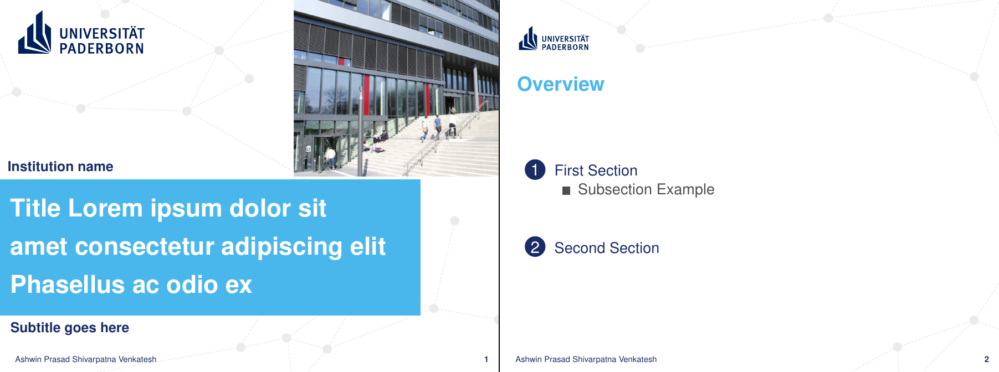
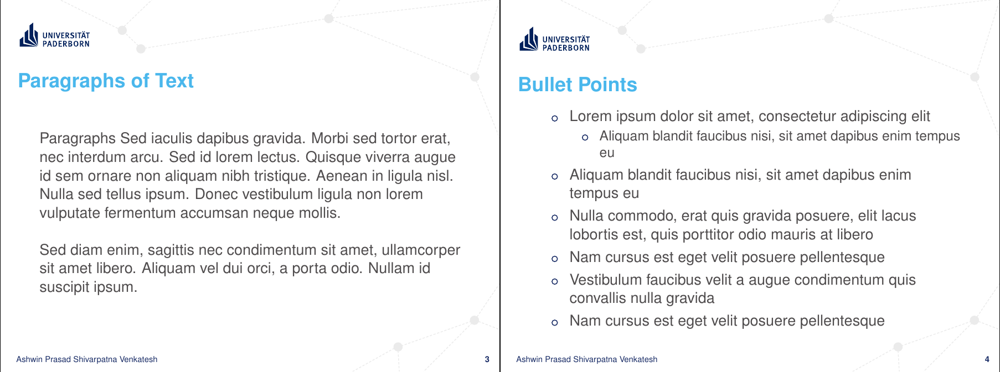

# University Paderborn LaTeX Beamer Template 

Easy to use LaTeX Beamer template that closely follows the official UPB PPT template. 

# Table of Contents
1. [Preview](#preview)
2. [Getting Started](#getting-started)
3. [Notes](#notes)

-------

## Preview

Sample PDF is available here [Usage-Example](Src/Usage-Example.pdf)

-----

## Getting Started

Note: If LaTeX is completely new to you, it makes sense to watch the video tutorial from [youtube](https://www.youtube.com/watch?v=SoDv0qhyysQ) and continue further.

1. Install [TeXstudio](https://www.texstudio.org/) (or similar LaTeX editor)
    + Windows
        + Install [MiKTeX](https://miktex.org/download) 
        + Install [TeXstudio](https://www.texstudio.org/)
    + Linux
        + `sudo add-apt-repository ppa:sunderme/texstudio`
        + `sudo apt-get update`
        + `sudo apt-get install texstudio`
    + Mac
        + Download official dmg file from [here](https://www.texstudio.org/#download)

2. Download this repository
    + Download the repository as zip
    + Extract and open the file `Usage-Example.tex` in TeXstudio
    + Press `F5` to compile and preview
    + Explore how to use this template to create your presentation by using various predefined slide examples

3. Edit presentation metadata to match your own
    + Open `presentation-details.tex` and edit details like author, title, preferred university defined color, etc...
    + Change the color preference by choosing one of the official UPB colors (choices are listed in the file)
        + E.g. `\newcommand{\upbcolor}{uni-green}`

4. Use Empty presentation to start from scratch
    + Open `Empty-Presentation.tex` to start with an empty presentation
    + You can choose to close/delete `Usage-Example.tex` file at this point

-----

## Notes

+ Official UPB typeface "Arial" has been left out of this template, a close replacement typeface "Helvetica" has been used here. However, "Arial Narrow" can be used by following the guide [here](https://tex.stackexchange.com/a/20145).

+ Colors defined under the file `internal/upb-unicolors.tex` are official UPB color codes taken from the "UPB Corporate Design Color Definition" []

+ On ubuntu you might have to run `sudo apt-get install texlive-fonts-recommended` to install fonts

-----

This template is free: you can redistribute it and/or modify it under the terms of the GNU General Public License as published by the Free Software Foundation, either version 3 of the License, or any later version.

